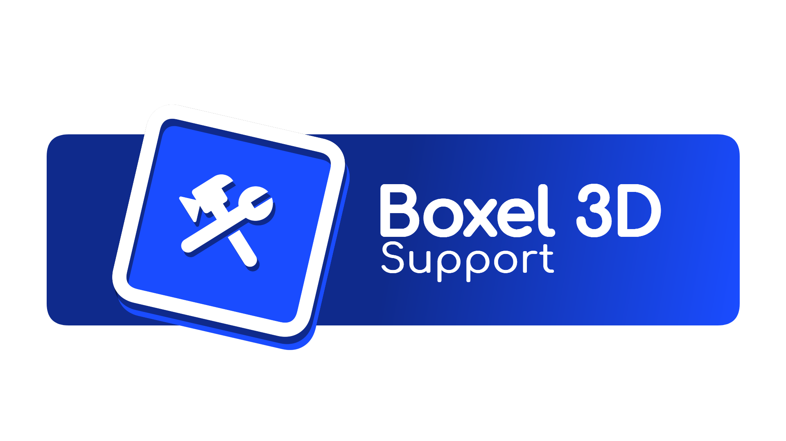
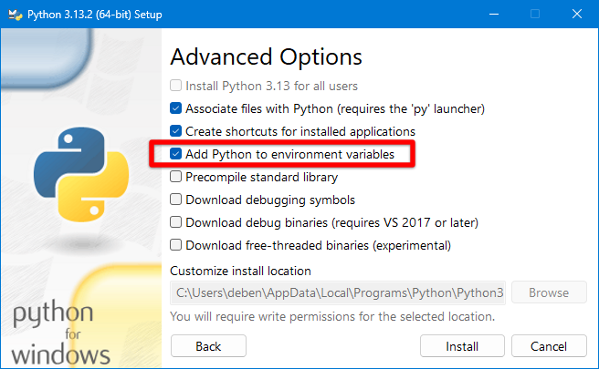
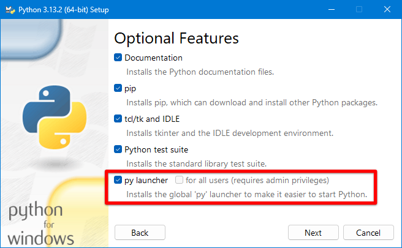

# Boxel 3D Support

Boxel 3D Support is an open source project for the community to submit issues or find documentation for modding.

## Submitting a bug

Please create a New issue with the appropriate information needed to resolve a bug. Link: https://github.com/doppl3r/boxel-3d-support/issues

## Local Development

The documentation for this website was made using a library called MkDocs. This tool requires Python libraries to build the web documents.

### Installing Python (Windows)

1. Download Python from the official website: https://www.python.org/downloads/
2. During the installation, be sure to check "py launcher" and "Add Python to environment variables"
3. (optional) Restart your computer if the Python commands are not working in the next steps

